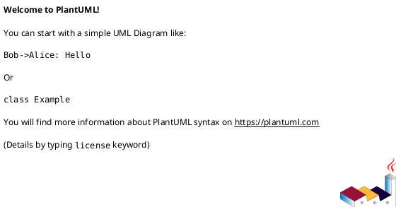

# Объектно-ориентированное программирование<br>Лекция 1

Введение. Принципы ООП. Классы и объекты. Поля, свойства, методы и атрибуты.

---

# Процедурное программирование

- Basic, C, Pascal, Go
- Главное - код для обработки данных, сами данные имеют второстепенное значение
- Простые программы, где весь функционал можно реализовать несколькими десятками процедур/функций.
- Много дубликации кода и дублирование данных.
- Все данные внутри процедуры видны только локально, а значит их нельзя использовать в другом месте.
- Высокий порог вхождения

---

# Объектно-ориентированное программирование

> **Объектно-ориентированное программирование (ООП)** — методология программирования, основанная на представлении программы в виде совокупности объектов, каждый из которых является экземпляром определённого класса, а классы образуют иерархию наследования.

::v-clicks{at=1}

- C++, Java, Python, ...
- Главное в программе - данные. Именно они определяют, какие методы будут использоваться для их обработки. Т. е. данные первичны, код для обработки этих данных - вторичен.
- Программа разбивается на объекты. Каждый объект отвечает за собственные данные и их обработку.
- Уменьшается дупликация кода.
- Упрощается и ускоряется процесс написания программ.

::

---

# Классы и объекты

**Класс** — в объектно-ориентированном программировании, представляет собой шаблон для создания объектов, обеспечивающий начальные значения состояний: инициализация полей-переменных и реализация поведения функций или методов.

**Объект** — некоторая сущность в цифровом пространстве, обладающая определённым состоянием и поведением, имеющая определенные свойства (поля) и операции над ними (методы). Как правило, при рассмотрении объектов выделяется то, что объекты принадлежат одному или нескольким классам, которые определяют поведение (являются моделью) объекта. Термины «экземпляр класса» и «объект» взаимозаменяемы.

---

# Классы и объекты

1. **Класс** описывает множество объектов, имеющих общую структуру и обладающих одинаковым поведением. Класс - это шаблон кода, по которому создаются объекты.
2. Данные внутри класса делятся на свойства и методы. **Свойства класса** (они же поля) - это характеристики объекта класса.
3. **Методы класса** - это функции, с помощью которых можно оперировать данными класса.
4. **Объект** - это конкретный представитель класса.
5. Объект класса и **экземпляр класса** - это одно и то же.

::center

> Класс = Свойства + Методы

::

---

# Пример

::center
<v-switch>
<template #0>



</template>
<template #1>


</template>
<template #2>


</template>
</v-switch>
::

---
layout: section
---

# Принципы ООП: абстракция, инкапсуляция, наследование, полиморфизм

---

# Принципы ООП: абстракция

<br>

> **Абстракция** - принцип ООП, согласно которому объект характеризуется свойствами, которые отличают его от всех остальных объектов и при этом четко определяют его концептуальные границы.

::v-clicks

1. Выделить главные и наиболее значимые свойства предмета.
2. Отбросить второстепенные характеристики.
   ::

<!--
Когда мы имеем дело с составным объектом - мы прибегаем к абстракции. Например, мы должны понимать, что перед нами абстракция, если мы рассматриваем объект как "дом", а не совокупность кирпича, стекла и бетона. А если уже представить множество домов как "город", то мы снова приходим к абстракции, но уже на уровень выше.

Зачем нужна абстракция? Если мыслить масштабно - то она позволяет бороться со сложностью реального мира. Мы отбрасываем все лишнее, чтобы оно нам не мешало, и концентрируемся только на важных чертах объекта.
-->

---

# Принципы ООП: инкапсуляция

<br>

> **Инкапсуляция** - принцип ООП, согласно которому сложность реализации программного компонента должна быть спрятана за его интерфейсом.

::v-clicks

1. Отсутствует доступ к внутреннему устройству программного компонента.
1. Взаимодействие компонента с внешним миром осуществляется посредством интерфейса, который включает публичные методы и поля.

**Для чего нужна инкапсуляция?**

1. Инкапсуляция упрощает процесс разработки.
2. Повышается надежность программ.
3. Становится более легким обмен компонентами между программами.
   ::

<!--
Абстракция утверждает следующее: "Объект может быть рассмотрен с общей точки зрения". А инкапсуляция от себя добавляет: "И это единственная точка зрения, с которой вы вообще можете рассмотреть этот объект."

Для чего нужна инкапсуляция?
1. Инкапсуляция упрощает процесс разработки, т. к. позволяет нам не вникать в тонкости реализации того или иного объекта.
1. Повышается надежность программ за счет того, что при внесении изменений в один из компонентов, остальные части программы остаются неизменными.
1. Становится более легким обмен компонентами между программами.
-->

---

# Принципы ООП: наследование

<br>

> **Наследование** - способ создания нового класса на основе уже существующего, при котором класс-потомок заимствует свойства и методы родительского класса и также добавляет собственные.

::v-clicks

1. Класс-потомок = Свойства и методы родителя + Собственные свойства и методы.
1. Класс-потомок автоматически наследует от родительского класса все поля и методы.
1. Класс-потомок может дополняться новыми свойствами.
1. Класс-потомок может дополняться новыми методами, а также заменять(переопределять) унаследованные методы.
   ::

<!--
Наследование используется в случае, если одни объекты аналогичны другим за исключением нескольких различий. Дадим определение:

1. Класс-потомок = Свойства и методы родителя + Собственные свойства и методы.
1. Класс-потомок автоматически наследует от родительского класса все поля и методы.
1. Класс-потомок может дополняться новыми свойствами.
1. Класс-потомок может дополняться новыми методами, а также заменять(переопределять) унаследованные методы. Переопределить родительский метод - это как? Это значит, внутри класса потомка есть метод, который совпадает по названию с методом родительского класса, но функционал у него новый - соответствующий потребностям класса-потомка.
-->

---

# Принципы ООП: наследование

::center
<v-switch>
<template #0>


</template>
<template #1>


</template>
<template #2>


</template>
<template #3>


</template>
</v-switch>
::

---

# Принципы ООП: полиморфизм

<br>

> **Полиморфизм** - это поддержка нескольких реализаций на основе общего интерфейса.

Другими словами, полиморфизм позволяет перегружать одноименные методы родительского класса в классах-потомках.

Также для понимания работы этого принципа важным является понятие абстрактного метода:

> **Абстрактный метод** (он же виртуальный метод) - это метод класса, реализация для которого отсутствует.

<!--
А теперь попробуем собрать все воедино. Для этого снова обратимся к классам Дом, Частный дом и Многоквартирный дом. Предположим, что на этапе написания кода мы еще знаем, какой из домов(частный или многоэтажный) нам предстоит создать, но вот то, что какой-то из них придется строить, мы знаем наверняка. В такой ситуации поступают следующим образом:

1. В родительском классе(в нашем случае - класс Дом) создают пустой метод(например, метод Построить() ) и делают его абстрактным.
1. В классах-потомках создают одноименные методы, но уже с соответствующей реализацией. И это логично, ведь например, процесс постройки Частного и Многоквартирного дома отличается кардинально. К примеру, для строительства Многоквартирного дома необходимо задействовать башенный кран, а Частный дом можно построить и собственными силами. При этом данный процесс все равно остается процессом строительства.
1. В итоге получаем метод с одним и тем же именем, который встречается во всех классах. В родительском - имеем только интерфейс, реализация отсутствует. В классах-потомках - имеем и интерфейс и реализацию. Причем в отличие от родительского класса реализация в потомках уже становится обязательной.
1. Теперь мы можем увидеть полиморфизм во всей его красе. Даже не зная, с объектом какого из классов-потомков мы работаем, нам достаточно просто вызвать метод Построить(). А уже в момент исполнения программы, когда класс объекта станет известен, будет вызвана необходимая реализация метода Построить().

Как итог - за одинаковым названием могут скрываться методы с совершенно разным функционалом, который в каждом конкретном случае соответствует нуждам класса, к которому он относится.
-->

---
layout: section
---

# Классы и объекты в Python

---

# Классы и объекты в Python

````md magic-move
```python
class <название_класса>:
    <тело_класса>

<имя_объекта> = <имя_класса>()
```

```python
class Car:
    pass

car_object = Car()
```
````

---

# Атрибуты класса в Python

> **Атрибут** - это любой элемент класса или объекта.

Все атрибуты можно разделить на 2 группы:

1. Встроенные (служебные) атрибуты
1. Пользовательские атрибуты

---

# Атрибуты класса в Python <br>Встроенные атрибуты

| Атрибут                        | Назначение                                                             | Тип     |
| ------------------------------ | :--------------------------------------------------------------------- | ------- |
| `__new__(cls[, ...])`          | Конструктор. Создает экземпляр(объект) класса.                         | Функция |
| `__init__(self[, ...])`        | Инициализатор. Принимает свежесозданный объект класса из конструктора. | Функция |
| `__del__(self)`                | Деструктор. Вызывается при удалении объекта сборщиком мусора           | Функция |
| `__str__(self)`                | Возвращает строковое представление объекта.                            | Функция |
| `__hash__(self)`               | Возвращает хэш-сумму объекта.                                          | Функция |
| `__setattr__(self, attr, val)` | Создает новый атрибут для объекта класса с именем attr и значением val | Функция |
| `__doc__`                      | Документация класса.                                                   | Строка  |
| `__dict__`                     | Словарь, в котором хранится пространство имен класса                   | Словарь |

---

# Атрибуты класса в Python <br>Пользовательские атрибуты

Список атрибутов класса / объекта можно получить с помощью команды dir().

<v-switch>
<template #0>

```python {monaco-run}{editorOptions: { wordWrap:'on', tabSize: 4, fontSize: 19.2, lineNumbers: 'on', autoIndent: 'full' }, height: 'auto'}
class Phone:
    pass

print(dir(Phone))
```

</template>
<template #1>

```python {monaco-run}{editorOptions: { wordWrap:'on', tabSize: 4, fontSize: 19.2, lineNumbers: 'on', autoIndent: 'full' }, height: 'auto'}
class Phone:
    color = 'Grey'
    def turn_on(self):
        pass
    def call(self):
        pass

print(dir(Phone))
```

</template>
</v-switch>

---

# Поля (свойства) класса в Python

Поля(они же свойства или переменные) можно (так же условно) разделить на две группы:

- Статические поля
- Динамические поля

---

# Поля (свойства) класса в Python<br>Статические поля

Это переменные, которые объявляются внутри тела класса и создаются тогда, когда создается класс.

```python {monaco-run}{editorOptions: { wordWrap:'on', tabSize: 4, fontSize: 19.2, lineNumbers: 'on', autoIndent: 'full' }, height: 'auto'}
class Phone:
    # Статические поля (переменные класса)
    default_color = 'Grey'
    default_model = 'C385'

```

---

# Поля (свойства) класса в Python<br>Динамические поля

Это переменные, которые создаются на уровне экземпляра класса. Для создания динамического свойства необходимо обратиться к `self` внутри метода:

```python {monaco-run}{editorOptions: {wordWrap:'on', tabSize: 4, fontSize: 19.2, lineNumbers: 'on', autoIndent: 'full'}, height: '270px'}
class Phone:
    # Статические поля (переменные класса)
    default_color = 'Grey'
    default_model = 'C385'

    def __init__(self, color, model):
        # Динамические поля (переменные объекта)
        self.color = color
        self.model = model

my_phone_red = Phone('Red', 'I495')
```
