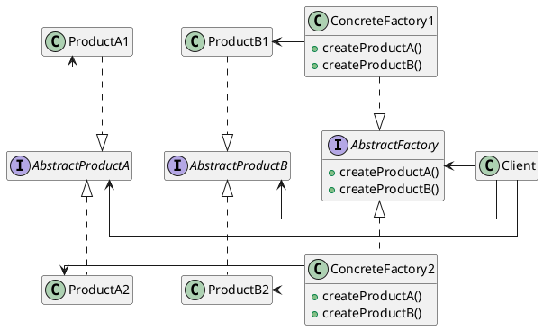
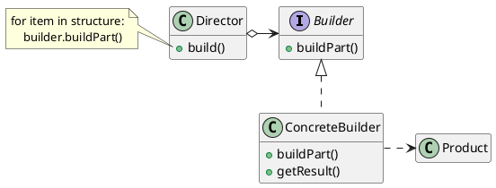
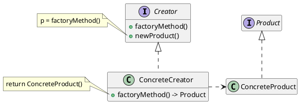
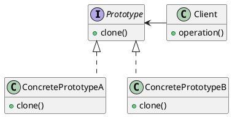

# Объектно-ориентированное программирование Лекция 10

Порождающие паттерны

---

# Порождающие паттерны

Порождающие паттерны проектирования абстрагируют процесс инстанцирования.

Они помогут сделать систему независимой от способа создания, композиции и представления объектов.

Паттерн, порождающий классы, использует наследование, чтобы варьировать инстанцируемый класс, а паттерн, порождающий объекты, делегирует инстанцирование другому объекту

---

# Абстрактная фабрика

::center

::

---

Предоставляет интерфейс для создания семейств взаимосвязанных или взаимозависимых объектов, не специфицируя их конкретных классов.

Используется, когда:

- система не должна зависеть от того, как создаются, компонуются и представляются входящие в нее объекты;
- входящие в семейство взаимосвязанные объекты должны использоваться вместе и вам необходимо обеспечить выполнение этого ограничения;
- система должна конфигурироваться одним из семейств составляющих ее объектов;
- вы хотите предоставить библиотеку объектов, раскрывая только их интерфейсы, но не реализацию.

---

# Абстрактная фабрика

::center

::

---

# Абстрактная фабрика. Плюсы

- изолирует конкретные классы. Помогает контролировать классы объектов, создаваемых приложением. Поскольку фабрика инкапсулирует ответственность за создание классов и сам процесс их создания, то она изолирует клиента от деталей реализации классов. Манипулирование экземплярами производится через их абстрактные интерфейсы.
- упрощает замену семейств продуктов. Класс конкретной фабрики появляется в приложении только один раз: при инстанцировании. Это облегчает замену используемой приложением конкретной фабрики. Приложение может изменить конфигурацию продуктов, просто подставив новую конкретную фабрику. Поскольку абстрактная фабрика создает все семейство продуктов, то и заменяется сразу все семейство.
- гарантирует сочетаемость продуктов. Если продукты некоторого семейства спроектированы для совместного использования, то важно, чтобы приложение в каждый момент времени работало только с продуктами единственного семейства. Класс `AbstractFactory` позволяет легко соблюсти это ограничение;

---

# Абстрактная фабрика. Минусы

- поддержать новый вид продуктов трудно. Расширение абстрактной фабрики для изготовления новых видов продуктов - непростая задача. Интерфейс AbstractFactory фиксирует набор продуктов, которые можно создать. Для поддержки новых продуктов необходимо расширить интерфейс фабрики, то есть изменить класс AbstractFactory и все его подклассы.

---

# Строитель (`Builder`)

::center

::

---

# Строитель (`Builder`)

Отделяет конструирование сложного объекта от его представления, так что в результате одного и того же процесса конструирования могут получаться разные представления.

Используйте паттерн строитель, когда:

- алгоритм создания сложного объекта не должен зависеть от того, из каких частей состоит объект и как они стыкуются между собой;
- процесс конструирования должен обеспечивать различные представления конструируемого объекта.

---

# Строитель (`Builder`)

::center

::

---

# Строитель (`Builder`). Результаты:

- позволяет изменять внутреннее представление продукта. Объект `Builder` предоставляет распорядителю абстрактный интерфейс для конструирования продукта, за которым он может скрыть представление и внутреннюю структуру продукта, а также процесс его сборки. Поскольку продукт конструируется через абстрактный интерфейс, то для изменения внутреннего представления достаточно всего лишь определить новый вид строителя;
- изолирует код, реализующий конструирование и представление. Паттерн строитель улучшает модульность, инкапсулируя способ конструирования и представления сложного объекта. Клиентам ничего не надо знать о классах, определяющих внутреннюю структуру продукта, они отсутствуют в интерфейсе строителя. Каждый конкретный строитель `ConcreteBuilder` содержит весь код, необходимый для создания и сборки конкретного вида продукта. Код пишется только один раз, после чего разные распорядители могут использовать его повторно для построения вариантов продукта из одних и тех же частей;

---

# Строитель (`Builder`). Результаты:

- дает более тонкий контроль над процессом конструирования. В отличие от порождающих паттернов, которые сразу конструируют весь объект целиком, строитель делает это шаг за шагом под управлением распорядителя. И лишь когда продукт завершен, распорядитель забирает его у строителя. Поэтому интерфейс строителя в большей степени отражает процесс конструирования продукта, нежели другие порождающие паттерны. Это позволяет обеспечить более тонкий контроль над процессом конструирования, а значит, и над внутренней структурой готового продукта.

---

# Фабричный метод (f`actory method`)

::center

::

---

# Фабричный метод (`factory method`)

Определяет интерфейс для создания объекта, но оставляет подклассам решение о том, какой класс инстанцировать. Фабричный метод позволяет классу делегировать инстанцирование подклассам.

Используйте паттерн фабричный метод, когда:

- классу заранее неизвестно, объекты каких классов ему нужно создавать;
- класс спроектирован так, чтобы объекты, которые он создает, специфицировались подклассами;
- класс делегирует свои обязанности одному из нескольких вспомогательных подклассов, и вы планируете локализовать знание о том, какой класс принимает эти обязанности на себя.

---

# Фабричный метод (`factory method`)

::center

::

---

# Фабричный метод (`factory method`)

- Фабричные методы избавляют проектировщика от необходимости встраивать в код зависящие от приложения классы. Код имеет дело только с интерфейсом класса Product, поэтому он может работать с любыми определенными пользователями классами конкретных продуктов.
- Потенциальный недостаток фабричного метода состоит в том, что клиентам, возможно, придется создавать подкласс класса `Creator` для создания лишь одного объекта `ConcreteProduct`. Порождение подклассов оправдано, если клиенту так или иначе приходится создавать подклассы `Creator`, в противном случае клиенту придется иметь дело с дополнительным уровнем подклассов.
- предоставляет подклассам операции-зацепки (`hooks`). Создание объектов внутри класса с помощью фабричного метода всегда оказывается более гибким решением, чем непосредственное создание. Фабричный метод создает в подклассах операции-зацепки для предоставления расширенной версии объекта.

---

# Фабричный метод (`factory method`)

- В примере с документом класс `Document` мог бы определить фабричный метод `CreateFileDialog`, который создает диалоговое окно для выбора файла существующего документа. Подкласс этого класса мог бы определить специализированное для приложения диалоговое окно, заместив этот фабричный метод. В данном случае фабричный метод не является абстрактным, а содержит разумную реализацию по умолчанию;
- соединяет параллельные иерархии. В примерах, фабричные методы вызывались только создателем. Но это совершенно необязательно: клиенты тоже могут применять фабричные методы, особенно при наличии параллельных иерархий классов.

---

# Прототип (`Prototype`)

::center

::

---

# Прототип (`Prototype`)

Задает виды создаваемых объектов с помощью экземпляра-прототипа и создает новые объекты путем копирования этого прототипа.

Используйте Прототип, когда:

- система не должна зависеть от того, как в ней создаются, компонуются и представляются продукты:
- инстанцируемые классы определяются во время выполнения, например с помощью динамической загрузки;
- для того чтобы избежать построения иерархий классов или фабрик, параллельных иерархии классов продуктов;
- экземпляры класса могут находиться в одном из не очень большого числа различных состояний. Может оказаться удобнее установить соответствующее число прототипов и клонировать их, а не инстанцировать каждый раз класс вручную в подходящем состоянии.

---

# Прототип (`Prototype`)

::center

::

---

# Прототип (`Prototype`)

У прототипа те же самые результаты, что у абстрактной фабрики и строителя: он скрывает от клиента конкретные классы продуктов, уменьшая тем самым число известных клиенту имен. Кроме того, все эти паттерны позволяют клиентам работать со специфичными для приложения классами без модификаций.

- добавление и удаление продуктов во время выполнения. Прототип позволяет включать новый конкретный класс продуктов в систему, просто сообщив
- клиенту о новом экземпляре-прототипе. Это несколько более гибкое решение по сравнению с тем, что удастся сделать с помощью других порождающих паттернов, ибо клиент может устанавливать и удалять прототипы во время выполнения;

---

# Прототип (`Prototype`)

- спецификация новых объектов путем изменения значений. Динамичные системы позволяют определять поведение за счет композиции объектов - например, путем задания значений переменных объекта, - а не с помощью определения новых классов. По сути дела, вы определяете новые виды объектов, инстанцируя уже существующие классы и регистрируя их-экземпляры как прототипы клиентских объектов. Клиент может изменить поведение, делегируя свои обязанности прототипу. Такой дизайн позволяет пользователям определять новые классы без программирования. Фактически клонирование объекта аналогично инстанцированию класса. Паттерн прототип может резко уменьшить число необходимых системе классов;

---

# Прототип (`Prototype`)

- специфицирование новых объектов путем изменения структуры. Многие приложения строят объекты из крупных и мелких составляющих. Например, редакторы для проектирования печатных плат создают электрические схемы из подсхем. Такие приложения часто позволяют инстанцировать сложные, определенные пользователем структуры, скажем, для многократного использования некоторой подсхемы. Паттерн прототип поддерживает и такую возможность. Мы просто добавляем подсхему как прототип в палитру доступных элементов схемы. При условии, что объект, представляющий составную схему, реализует операцию `Clone` как глубокое копирование, схемы с разными структурами могут выступать в качестве прототипов;
- уменьшение числа подклассов. Прототип позволяет клонировать прототип, а не запрашивать фабричный метод создать новый объект;
- динамическое конфигурирование приложения классами. Некоторые среды позволяют динамически загружать классы в приложение во время его выполнения.

---

# Прототип (`Prototype`)

Основной недостаток паттерна прототип заключается в том, что каждый подкласс класса `Prototype` должен реализовывать операцию `Clone`, а это далеко не всегда просто. Например, сложно добавить операцию `Clone`, когда рассматриваемые классы уже существуют. Проблемы возникают и в случае, если во внутреннем представлении объекта есть другие объекты или цикличные ссылки.

---

# Одиночка (`Singleton`)

::center

::

---

# Одиночка (`Singleton`)

Гарантирует, что у класса есть только один экземпляр, и предоставляет к нему глобальную точку доступа.

Используйте паттерн синглтон, когда:

- должен быть ровно один экземпляр некоторого класса, легко доступный всем клиентам;
- единственный экземпляр должен расширяться путем порождения подклассов, и клиентам нужно иметь возможность работать с расширенным экземпляром без модификации своего кода.

---

# Одиночка (`Singleton`)

У паттерна `Singleton` есть определенные достоинства:

- контролируемый доступ к единственному экземпляру. Поскольку класс `Singleton` инкапсулирует свой единственный экземпляр, он полностью
- контролирует то, как и когда клиенты получают доступ к нему;
- уменьшение числа имен. Паттерн `Singleton` - шаг вперед по сравнению с глобальными переменными. Он позволяет избежать засорения пространства имен глобальными переменными, в которых хранятся уникальные экземпляры;
- допускает уточнение операций и представления. От класса `Singleton` можно порождать подклассы, а приложение легко сконфигурировать экземпляром расширенного класса. Можно конкретизировать приложение экземпляром того класса, который необходим во время выполнения;

---

# Одиночка (`Singleton`)

- допускает переменное число экземпляров. Паттерн позволяет вам легко изменить свое решение и разрешить появление более одного экземпляра класса `Singleton`. Вы можете применять один и тот же подход для управления числом экземпляров, используемых в приложении. Изменить нужно будет лишь операцию, дающую доступ к экземпляру класса `Singleton`;
- большая гибкость, чем у операций класса. Еще один способ реализовать функциональность одиночки - использовать операции класса, то есть статические функции-члены (`classmethod`) препятствуют изменению дизайна, если потребуется разрешить наличие нескольких экземпляров класса.
