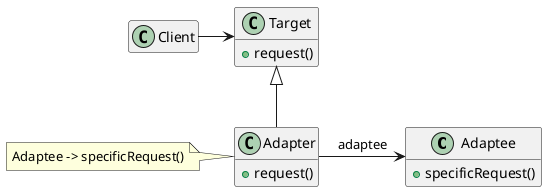
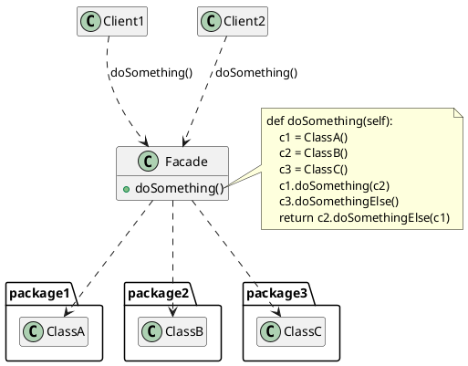
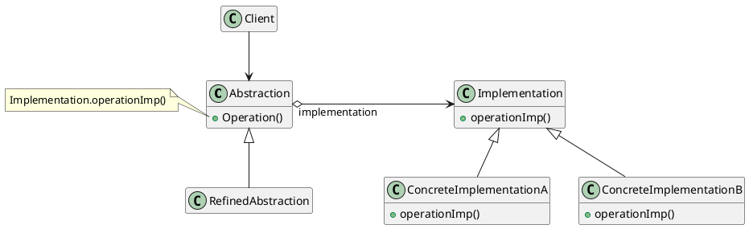
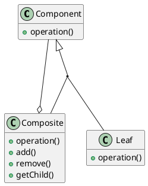
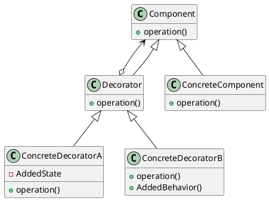
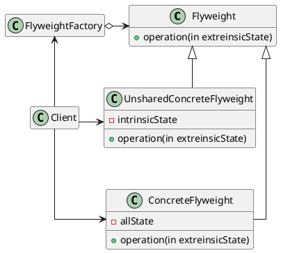
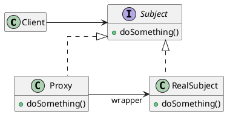

# Объектно-ориентированное программирование Лекция 7

Структурные паттерны

---

# Структурные паттерны программирования

- В структурных паттернах рассматривается вопрос о том, как из классов и объектов образуются более крупные структуры.
- Структурные паттерны уровня класса используют наследование для составления композиций из интерфейсов и реализаций.
- Вместо композиции интерфейсов или реализаций структурные паттерны уровня объекта компонуют объекты для получения новой функциональности. Дополнительная гибкость в этом случае связана с возможностью изменить композицию объектов во время выполнения, что недопустимо для статической композиции классов.

---

# Паттерн Адаптер (`Adapter`)

::center

::

---

# Паттерн Адаптер (`Adapter`)

- Преобразует интерфейс одного класса в интерфейс другого, который ожидают клиенты. Адаптер обеспечивает совместную работу классов с несовместимыми интерфейсами, которая без него была бы невозможна.
  Используется, когда вы:
- хотите использовать существующий класс, но его интерфейс не соответствует вашим потребностям;
- собираетесь создать повторно используемый класс, который должен взаимодействовать с заранее неизвестными или не связанными с ним классами, имеющими несовместимые интерфейсы;
- (только для адаптера объектов!) нужно использовать несколько существующих подклассов, но непрактично адаптировать их интерфейсы путем порождения новых подклассов от каждого. В этом случае адаптер объектов может приспосабливать интерфейс их общего родительского класса.

---

# Паттерн Адаптер (`Adapter`)

::center

::

---

# Результаты

Адаптер класса:

- адаптирует `Adaptee` к `Target`, перепоручая действия конкретному классу `Adaptee`. Поэтому данный паттерн не будет работать, если мы захотим одновременно адаптировать класс и его подклассы;
- позволяет адаптеру `Adapter` заместить некоторые операции адаптируемого класса `Adaptee`, так как `Adapter` есть не что иное, как подкласс `Adaptee`;
- вводит только один новый объект. Чтобы добраться до адаптируемого класса, не нужно никакого дополнительного обращения по указателю.

---

# Результаты

Адаптер объектов:

- позволяет одному адаптеру `Adapter` работать со многим адаптируемыми объектами `Adaptee`, то есть с самим `Adaptee` и его подклассами (если таковые имеются). Адаптер может добавить новую функциональность сразу всем адаптируемым объектам;
- затрудняет замещение операций класса `Adaptee`. Для этого потребуется породить от `Adaptee` подкласс и заставить `Adapter` ссылаться на этот подкласс, а не на сам `Adaptee`.

---

# Паттерн Фасад (Facade)

::center

::

---

# Паттерн Фасад (Facade)

- Фасад - паттерн, структурирующий объекты.
- Предоставляет унифицированный интерфейс вместо набора интерфейсов некоторой подсистемы. Фасад определяет интерфейс более высокого уровня, который упрощает использование подсистемы.

---

# Паттерн Фасад (Facade)

::center

::

---

# Паттерн Фасад (Facade)

Используйте паттерн фасад, когда вы:

- хотите предоставить простой интерфейс к сложной подсистеме. Часто подсистемы усложняются по мере развития. Применение большинства паттернов приводит к появлению меньших классов, но в большем количестве. Такую подсистему проще повторно использовать и настраивать под конкретные нужды, но вместе с тем применять подсистему без настройки становится труднее. Фасад предлагает некоторый вид системы по умолчанию, устраивающий большинство клиентов. И лишь те объекты, которым нужны более широкие возможности настройки, могут обратиться напрямую к тому, что находится за фасадом;

---

# Паттерн Фасад (Facade)

- между клиентами и классами реализации абстракции существует много зависимостей. Фасад позволит отделить подсистему как от клиентов, так и от других подсистем, что, в свою очередь, способствует повышению степени независимости и переносимости;
- вы хотите разложить подсистему на отдельные слои. Используйте фасад для определения точки входа на каждый уровень подсистемы. Если подсистемы зависят друг от друга, то зависимость можно упростить, разрешив подсистемам обмениваться информацией только через фасады.

---

# Паттерн Мост (Bridge)

::center

::

---

# Паттерн Мост (Bridge)

- Мост - паттерн, структурирующий объекты.
- Отделить абстракцию от ее реализации так, чтобы то и другое можно было изменять независимо.

---

# Паттерн Мост (Bridge)

::center

::

---

# Паттерн Мост (Bridge)

Используйте паттерн мост, когда:

- хотите избежать постоянной привязки абстракции к реализации. Так, например, бывает, когда реализацию необходимо выбирать во время выполнения программы;
- и абстракции, и реализации должны расширяться новыми подклассами. В таком случае паттерн мост позволяет комбинировать разные абстракции и реализации и изменять их независимо;
- изменения в реализации абстракции не должны сказываться на клиентах, то есть клиентский код не должен перекомпилироваться;
- число классов начинает быстро расти. Это признак того, что иерархию следует разделить на две части;
- вы хотите разделить одну реализацию между несколькими объектами (быть может, применяя подсчет ссылок), и этот факт необходимо скрыть от клиента.

---

# Результаты

- отделение реализации от интерфейса. Реализация больше не имеет постоянной привязки к интерфейсу. Реализацию абстракции можно конфигурировать во время выполнения. Объект может даже динамически изменять свою реализацию. Разделение классов `Abstraction` и `Implementor` устраняет также зависимости от реализации, устанавливаемые на этапе компиляции. Чтобы изменить класс реализации, вовсе не обязательно перекомпилировать класс `Abstraction` и его клиентов. Это свойство особенно важно, если необходимо обеспечить двоичную совместимость между разными версиями библиотеки классов.

---

# Результаты

- Кроме того, такое разделение облегчает разбиение системы на слои и тем самым позволяет улучшить ее структуру. Высокоуровневые части системы должны знать только о классах `Abstraction` и `Implementor`;
- повышение степени расширяемости. Можно расширять независимо иерархии классов `Abstraction` и `Implementor`;
- сокрытие деталей реализации от клиентов. Клиентов можно изолировать от таких деталей реализации, как разделение объектов класса `Implementor` и сопутствующего механизма подсчета ссылок.

---

# Адаптер, фасад и мост

У паттернов адаптер и мост есть несколько общих атрибутов. Тот и другой повышают гибкость, вводя дополнительный уровень косвенности при обращении к другому объекту. Оба перенаправляют запросы другому объекту, используя иной интерфейс.

Основное различие между адаптером и мостом в их назначении.

- Цель адаптера - устранить несовместимость между двумя существующими интерфейсами. При разработке адаптера не учитывается, как эти интерфейсы реализованы и то, как они могут независимо развиваться в будущем. Он должен лишь обеспечить совместную работу двух независимо разработанных классов, так чтобы ни один из них не пришлось переделывать.
- С другой стороны, мост связывает абстракцию с ее, возможно, многочисленными реализациями. Данный паттерн предоставляет клиентам стабильный интерфейс, позволяя в то же время изменять классы, которые его реализуют.

---

# Адаптер, фасад и мост

Когда выясняется, что два несовместимых класса должны работать вместе, следует обратиться к адаптеру. Тем самым удастся избежать дублирования кода.

Наоборот, пользователь моста с самого начала понимает, что у абстракции может быть несколько реализаций и развитие того и другого будет идти независимо

Адаптер обеспечивает работу после того, как нечто спроектировано; мост - до того.

Фасад можно представлять себе как адаптер к набору других объектов. Но при такой интерпретации легко не заметить такой нюанс: фасад определяет новый интерфейс, тогда как адаптер повторно использует уже имеющийся. Адаптер заставляет работать вместе два существующих интерфейса, а не определяет новый.

---

# Паттерн Компоновщик (Composite)

::center

::

---

# Паттерн Компоновщик (Composite)

- Компоновщик - паттерн, структурирующий объекты.
- Компонует объекты в древовидные структуры для представления иерархий часть-целое. Позволяет клиентам единообразно трактовать индивидуальные и составные объекты.

Используйте паттерн компоновщик, когда:

- нужно представить иерархию объектов вида часть-целое;
- хотите, чтобы клиенты единообразно трактовали составные и
  индивидуальные объекты.

---

# Паттерн Компоновщик (Composite)

::center

---

# Паттерн Компоновщик (Composite). Результаты

- определяет иерархии классов, состоящие из примитивных и составных объектов. Из примитивных объектов можно составлять более сложные, которые, в свою очередь, участвуют в более сложных композициях и так далее. Любой клиент, ожидающий примитивного объекта, может работать и с составным;
- упрощает архитектуру клиента. Клиенты могут единообразно работать с индивидуальными объектами и с составными структурами. Обычно клиенту неизвестно, взаимодействует ли он с листовым или составным объектом. Это упрощает код клиента, поскольку нет необходимости писать функции, ветвящиеся в зависимости от того, с объектом какого класса они работают;

---

# Паттерн Компоновщик (Composite). Результаты

- облегчает добавление новых видов компонентов. Новые подклассы будут автоматически работать с уже существующими структурами и клиентским кодом. Изменять клиента при добавлении новых компонентов не нужно;
- способствует созданию общего дизайна. Однако такая простота добавления новых компонентов имеет и свои отрицательные стороны: становится трудно наложить ограничения на то, какие объекты могут входить в состав композиции. Иногда желательно, чтобы составной объект мог включать только определенные виды компонентов. Паттерн компоновщик не позволяет воспользоваться для реализации таких ограничений статической системой типов. Вместо этого следует проводить проверки во время выполнения.

---

# Паттерн Декоратор (Decorator)

::center

::

---

# Паттерн Декоратор (Decorator)

- Декоратор - паттерн, структурирующий объекты.
- Динамически добавляет объекту новые обязанности. Является гибкой альтернативой порождению подклассов с целью расширения функциональности.

Используйте паттерн декоратор:

- для динамического, прозрачного для клиентов добавления обязанностей объектам;
- для реализации обязанностей, которые могут быть сняты с объекта;
- когда расширение путем порождения подклассов по каким-то причинам неудобно или невозможно. Иногда приходится реализовывать много независимых расширений, так что порождение подклассов для поддержки всех возможных комбинаций приведет к комбинаторному росту их числа. В других случаях определение класса может быть скрыто или почему-либо еще недоступно,так что породить от него подкласс нельзя.

---

# Паттерн Декоратор (Decorator)

::center

::

---

# Паттерн Декоратор (Decorator). Результаты

- бОльшая гибкость, нежели у статического наследования. Паттерн декоратор позволяет более гибко добавлять объекту новые обязанности, чем было бы возможно в случае статического (множественного) наследования. Декоратор может добавлять и удалять обязанности во время выполнения программы. При использовании же наследования требуется создавать новый класс для каждой дополнительной обязанности, что ведет к увеличению числа классов и, как следствие, к возрастанию сложности системы. Кроме того, применение нескольких декораторов к одному компоненту позволяет произвольным образом сочетать обязанности. Декораторы позволяют легко добавить одно и то же свойство дважды, но это может быть чревато ошибками;

---

# Паттерн Декоратор (Decorator). Результаты

- позволяет избежать перегруженных функциями классов на верхних уровнях иерархии. Декоратор разрешает добавлять новые обязанности по мере необходимости. Вместо того чтобы пытаться поддержать все мыслимые возможности в одном сложном, допускающем разностороннюю настройку классе, вы можете определить простой класс и постепенно наращивать его функциональность с помощью декораторов. В результате приложение уже не платит за неиспользуемые функции. Нетрудно также определять новые виды декораторов независимо от классов, которые они расширяют, даже если первоначально такие расширения не планировались. При расширении же сложного класса обычно приходится вникать в детали, не имеющие отношения к добавляемой функции;

---

# Паттерн Декоратор (Decorator). Результаты

- декоратор и его компонент не идентичны. Декоратор действует как прозрачное обрамление. Но декорированный компонент все же не идентичен исходному. При использовании декораторов это следует иметь в виду;
- множество мелких объектов. При использовании в проекте паттерна декоратор нередко получается система, составленная из большого числа мелких объектов, которые похожи друг на друга и различаются только способом взаимосвязи, а не классом и не значениями своих внутренних переменных. Хотя проектировщик, разбирающийся в устройстве такой системы, может легко настроить ее, но изучать и отлаживать ее очень тяжело.

---

# Паттерн Приспособленец (Flyweight)

::center

::

---

# Паттерн Приспособленец (Flyweight)

- Приспособленец - паттерн, структурирующий объекты.
- Использует разделение для эффективной поддержки множества мелких объектов.

Применяйте этот паттерн, когда выполнены все нижеперечисленные условия одновременно:

- в приложении используется большое число объектов;
- из-за этого накладные расходы на хранение высоки;
- большую часть состояния объектов можно вынести вовне;
- многие группы объектов можно заменить относительно небольшим количеством разделяемых объектов, поскольку внешнее состояние вынесено;
- приложение не зависит от идентичности объекта. Поскольку объекты приспособленцы могут разделяться, то проверка на идентичность возвратит «истину» для концептуально различных объектов.

---

# Паттерн Приспособленец (Flyweight)

::center

::

---

# Паттерн Приспособленец (Flyweight). Результаты

При использовании приспособленцев не исключены затраты на передачу, поиск или вычисление внутреннего состояния, особенно если раньше оно хранилось как внутреннее. Однако такие расходы с лихвой компенсируются экономией памяти за счет разделения объектов-приспособленцев. Экономия памяти возникает по ряду причин:

- уменьшение общего числа экземпляров;
- сокращение объема памяти, необходимого для хранения внутреннего состояния;
- вычисление, а не хранение внешнего состояния (если это действительно так).
  Чем выше степень разделения приспособленцев,тем существеннее экономия.

С увеличением объема разделяемого состояния экономия также возрастает. Самого большого эффекта удается добиться, когда суммарный объем внутренней и внешней информации о состоянии велик, а внешнее состояние вычисляется, а не хранится. Тогда разделение уменьшает стоимость хранения внутреннего состояния, а за счет вычислений сокращается память, отводимая под внешнее состояние.

---

# Паттерн Заместитель (Proxy)

::center

::

---

# Паттерн Заместитель (Proxy)

- Заместитель - паттерн, структурирующий объекты.
- Является суррогатом другого объекта и контролирует доступ к нему.
- Паттерн заместитель применим во всех случаях, когда возникает необходимость сослаться на объект более изощренно, чем это возможно, если использовать простой указатель.
- Примеры:
  - удаленный заместитель может предоставлять доступ к объекту в другом адресном пространстве;
  - защищающий заместитель может ограничивать доступ к другому объекту;
  - виртуальный заместитель может создавать тяжёлые объекты по требованию (изображения,файлы).

---

# Паттерн Заместитель (Proxy)

::center

::

---

# Паттерн Заместитель (Proxy). Результаты

- удаленный заместитель может скрыть тот факт, что объект находится в другом адресном пространстве;
- виртуальный заместитель может выполнять оптимизацию, например создание объекта по требованию;
- защищающий заместитель и «умная» ссылка позволяют решать дополнительные задачи при доступе к объекту.

---

# Компоновщик, декоратор и заместитель

- При обнаружении сходства между компоновщиком и декоратором может возникнуть искушение посчитать объект декоратор вырожденным случаем компоновщика, но при этом будет искажен сам смысл паттерна декоратор. Сходство и заканчивается на рекурсивной композиции, и снова из-за различия задач, решаемых с помощью паттернов.
- Назначение декоратора - добавить новые обязанности объекта без порождения подклассов. Этот паттерн позволяет избежать комбинаторного роста числа подклассов, если проектировщик пытается статически определить все возможные комбинации.
- У компоновщика другие задачи. Он должен так структурировать классы, чтобы различные взаимосвязанные объекты удавалось трактовать единообразно, а несколько объектов рассматривать как один. Акцент здесь делается не на оформлении, а на представлении.

---

# Компоновщик, декоратор и заместитель

- Указанные цели различны, но дополняют друг друга. Поэтому компоновщик и декоратор часто используются совместно. Оба паттерна позволяют спроектировать систему так, что приложения можно будет создавать, просто соединяя объекты между собой, без определения новых классов.
- Заместитель - еще один паттерн, структура которого напоминает декоратор. Оба они описывают, как можно предоставить косвенный доступ к объекту, и в реализации объектов-декораторов и заместителей хранится ссылка на другой объект, которому переадресуются запросы. Но и здесь цели различаются.

---

# Компоновщик, декоратор и заместитель

- Как и декоратор, заместитель предоставляет клиенту интерфейс, совпадающий с интерфейсом замещаемого объекта. Но в отличие от декоратора заместителю не нужно динамически добавлять и отбирать свойства, он не предназначен для рекурсивной композиции. Заместитель должен предоставить стандартную замену субъекту, когда прямой доступ к нему неудобен или нежелателен, например потому, что он находится на удаленной машине, хранится на диске или доступен лишь ограниченному кругу клиентов. В паттерне заместитель субъект определяет основную функциональность, а заместитель разрешает или запрещает доступ к ней.
